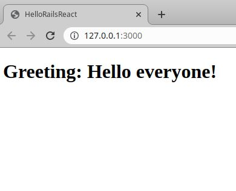

# Hello world:

A practice project - react on rails.



## Description:

Practice to build React components as a part of Rails JavaScript and serve it in a component, to be used in a regular ERB file. Everytime the page loads you see a random greeting message from the database.

## Built With

- Ruby
- Ruby on Rails
- PostgreSQL
- React
- Redux

## Getting Started

To get a local copy up and running follow these simple example steps.

## Instructions

```
$ cd <folder>
```

```
$ git clone git@github.com:PolinaStamenova/hello-rails-react.git
```

```
$ cd hello-rails-react
```

## Install

```
$ bundle install
```

## Run

```
$ rails db:create
```

```
$ rails db:migrate
```

```
$ rails db:seed
```

### In your terminal run:

```
bin/webpack-dev-server
```

### Open a new terminal and run:

```
rails s
```

## Authors

👤 **Polina Stamenova**

- GitHub: [@githubhandle](https://github.com/PolinaStamenova)
- LinkedIn: [LinkedIn](https://www.linkedin.com/in/polina-stamenova-a60766112/)

## 🤝 Contributing

Contributions, issues, and feature requests are welcome!

Feel free to check the [issues page](https://github.com/PolinaStamenova/hello-rails-react/issues).

## Show your support

Give a ⭐️ if you like this project!

## Acknowledgments

- Microverse
